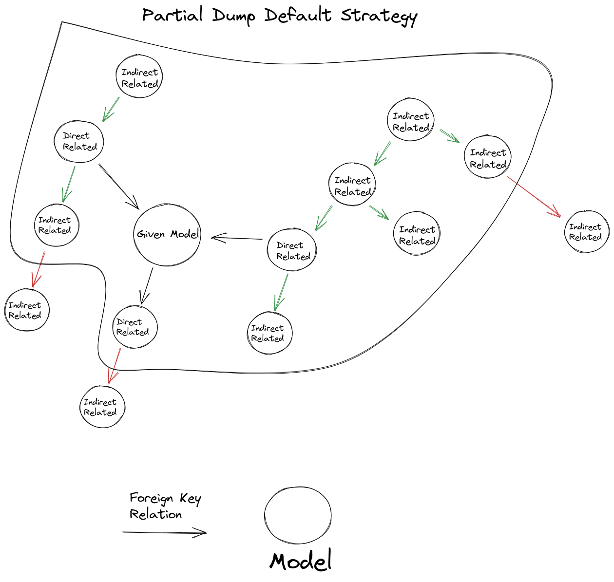

## Mongoose Partial Dump

A partial dumper helper for a mongoose environment.

This package will aid developers to create partial dumps of a mongoDB database using mongoose. Making possible to easily dump only documents related to specifics functionalities of a bigger project.

### Inputs

### Installation

-  `npm install -g mongoose-partial-dumper`
-  `npm install mongoose-partial-dumper`
-  `yarn add mongoose-partial-dump`

### Usage

-  Create a partial-dump.config.{ts, js} file
-  `yarn partial dump <collectionName> [id]`

### Strategies

#### Default

#### Config

| Install:   | type:        | Description:                                | Required: | example:                                   |
| ---------- | ------------ | ------------------------------------------- | --------- | ------------------------------------------ |
| db         | object       | database input configurations               | **true**  | {url: ''}                                  |
| db.url     | string       | database url configurations                 | **true**  | <mongodb://localhost:27017/dumper-example> |
| models     | Model<any>[] | Mongoose Model list                         | **true**  | {models: [User]}                           |
| getPayload | function     | Function that returns a Model.find() Object | **false** | {\_id: <ObjectId>, company: <ObjectId>}    |
| outputDir  | string       | database input configurations               | **false** | 'dump.json'                                |

#### CLI

##### Arguments

| Input:         | type:  | Description:                                                            | Required: | example:                   |
| -------------- | ------ | ----------------------------------------------------------------------- | --------- | -------------------------- |
| collectionName | string | Main collection name to be base of your dump                            | **true**  | 'User'                     |
| id             | string | If given, dump will priorize this input to return all documents related | **false** | '60b40699c73c9095df00c22b' |
| outputDir      | string | Path to file to be created or overwriten                                | **false** | 'dump.json'                |

##### Options

| Input: | type:  | Description:                                                                           | Required: | example: |
| ------ | ------ | -------------------------------------------------------------------------------------- | --------- | -------- |
| --log  | string | If this option is given, no file will be generated, instead a log will show on console | **false** | 'User'   |

### Examples

-  Mongoose partial dumper example - https://github.com/Streeterxs/mongoose-partial-dump (use the scripts in package.json to make your tests easier)
